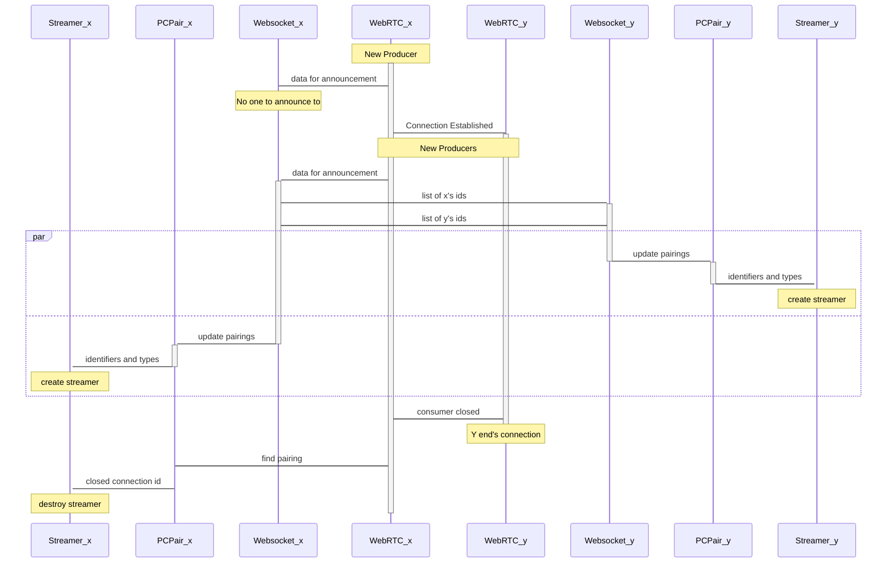

```mermaid
sequenceDiagram
participant Streamer_x
participant PCPair_x
participant Websocket_x
participant WebRTC_x
participant WebRTC_y
participant Websocket_y
participant PCPair_y
participant Streamer_y

%% Start - nothing happens
Note over WebRTC_x: New Producer
activate WebRTC_x
WebRTC_x->Websocket_x: data for announcement
Note over Websocket_x: No one to announce to

%% client Y connects
WebRTC_y->WebRTC_x: Connection Established
activate WebRTC_y
Note over WebRTC_y, WebRTC_x: New Producers
%% X send Y announcement
WebRTC_x->+Websocket_x: data for announcement
Websocket_x->+Websocket_y: list of x's ids
Websocket_y->Websocket_x: list of y's ids
par
Websocket_y->+PCPair_y: update pairings
deactivate Websocket_y
PCPair_y->+Streamer_y: identifiers and types
deactivate PCPair_y
Note over Streamer_y: create streamer

and
Websocket_x->+PCPair_x: update pairings
deactivate Websocket_x
PCPair_x->+Streamer_x: identifiers and types
deactivate PCPair_x
Note over Streamer_x: create streamer
end

%% Y hangs up
WebRTC_y->WebRTC_x: consumer closed
Note over WebRTC_y: Y end's connection
deactivate WebRTC_y

%% x removes streamer
WebRTC_x->PCPair_x: find pairing
PCPair_x->Streamer_x: closed connection id
Note over Streamer_x: destroy streamer

deactivate WebRTC_x
```

